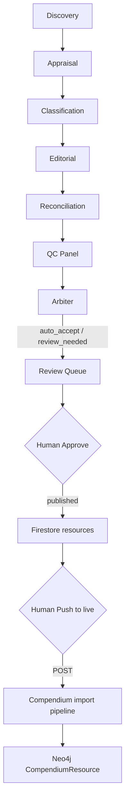

# CoThesis Curation Agent → Compendium Integration Handoff

**Audience:** Compendium engineering team  
**From:** CoThesis Curation Agent (GCP / ADK pipeline + HITL console)  
**Date:** 2026-06-09  
**Status:** Compendium integration response received (2026-06-09) — see [`docs/COMPENDIUM_RESPONSE.md`](COMPENDIUM_RESPONSE.md). Per-resource `resource_id` / `public_url` now returned by Compendium; **re-sync** 39 legacy batch-only records to populate Firestore `compendium_id` / `compendium_url`.

---

## 1. Executive summary

The **CoThesis Curation Agent** is a multi-agent ADK pipeline (Vertex AI / Gemini 3, Cloud Run) that discovers, appraises, classifies, edits, QC-reviews, and routes research-methodology resources for medical trainees. Human reviewers ratify drafts in a Next.js **HITL console** before anything is published.

**Relationship to Compendium:**

| Layer | Role |
|---|---|
| Curation Agent | AI pipeline + human review → produces ratified **Resource** records in Firestore |
| HITL Console | Publish gate: reviewer approves → `editorial_status: published` in Firestore; **manual Push to live** POSTs to Compendium |
| Compendium | Receives pre-classified, pre-edited **ImportCandidate** payloads via `POST /api/import/json`; runs its own import queue (dedup → classify → accept → enrich) |

We are **not** sending raw discovery candidates. We send human-ratified records with platform methodology codes, editorial descriptions, and taxonomy already assigned. Compendium's import worker should treat these as **trusted upstream classification** (or skip re-classification) — see §7 on the outdated classify worker.

**Single source of mapping truth:** `agents/shared/compendium_bridge.py` (Python) and `console/lib/compendium-sync.ts` (TypeScript mirror).

---

## 2. End-to-end flow



### Pipeline stages (agent side)

1. **Discovery** — find candidates via academic APIs (PubMed, OpenAlex, etc.)
2. **Appraisal** — quality_score (0–100), 6 quality dimensions, ai_confidence
3. **Classification** — resource type/subtype, **platform methodology codes** (SYN-01, OBS-01, …), discipline slugs, access type
4. **Editorial** — `editorial_description`, `summary`, `editorial_description_plain`, proposed badges
5. **Reconciliation** — dedup + assemble draft record
6. **QC Panel** — independent dimension evaluators + brand/AI-pattern checks
7. **Arbiter** — routes to auto-accept, review queue, or auto-exclude

### Firestore collections

| Collection | Purpose |
|---|---|
| `drafts` / `pipeline_state` | AI pipeline working state |
| `review_queue` | Items awaiting human decision (`status: pending`) |
| `resources` | Ratified records; **only `editorial_status: published`** are synced to Compendium |

### Human publish gate

On approve, the console writes to `resources` with:
- Full ratified draft fields
- `editorial_badges` (max 3, human-ratified)
- `editorial_reviewed_by`, `editorial_reviewed_at`
- `editorial_status: "published"`

Publish checklist (enforced before approve): editorial_description present · ≥1 platform methodology_code · quality_score present · link verified · human ratification fields set.

---

## 3. When we call Compendium

| Trigger | Code path | Behaviour |
|---|---|---|
| **Push to live** (pipeline table / record editor) | `syncToCompendium()` / `syncBatchToCompendium()` | Manual POST for published rows where sync is pending or failed |
| **Single approve** (review detail) | `approveItem()` | Writes `editorial_status: published` to Firestore only — **no Compendium POST** |
| **Bulk approve** | `bulkApproveAsDrafted()` | Same as single approve — Firestore publish only |
| **Published page retry** | `PublishedResourcesTable` → `syncToCompendium()` / `syncBatchToCompendium()` | Manual push for rows where `compendium_synced_at` is absent or `compendium_sync_error` is set |
| **CLI** | `python -m scripts.sync_to_compendium [--dry-run] [--batch-size N]` | Scans Firestore for published + unsynced records |
| **Cloud Run Job** | Job name: `sync-to-compendium` (image entrypoint overridden to `scripts.sync_to_compendium`) | Same logic as CLI; intended for scheduled/batch catch-up |

**Sync eligibility (all paths):**
- `editorial_status == "published"`
- `compendium_synced_at` absent **or** `compendium_sync_error` present (retry)
- Already synced with no error → **skipped**

**Batch size:** 50 records per POST (configurable via `--batch-size`).

**Note:** `scripts/sync.py` docstring references a Cloud Run `/trigger/sync` endpoint + Cloud Scheduler every 30 minutes. The implemented catch-up path today is the **`sync-to-compendium` Cloud Run Job** and CLI; verify whether `/trigger/sync` is wired on the agent service before relying on it.

---

## 4. HTTP contract

### Endpoint

```
POST {COMPENDIUM_IMPORT_URL}/api/import/json
```

- **Base URL:** from env `COMPENDIUM_IMPORT_URL` (fallback in console: `COMPENDIUM_BASE_URL`)
- **Production Compendium (Railway):** `https://compendium-web-production.up.railway.app`
- **Public site (when live):** `https://cothesis.ai` (per `.env.example` comment)

Trailing slashes on base URL are stripped before appending `/api/import/json`.

### Method & headers

| Header | Value |
|---|---|
| `Content-Type` | `application/json` |
| `Authorization` | `Bearer {IMPORT_API_KEY}` |

**We do not send `x-import-key`.** If Compendium prefers that header, please confirm and we will align (see §7).

**Timeout:** 30 seconds.

### Request body schema

Top-level envelope:

```json
{
  "source_file": "cothesis-console-sync-2026-06-09",
  "source_tool": "claude",
  "resources": [ /* ImportCandidate[] */ ]
}
```

| Field | Type | Notes |
|---|---|---|
| `source_file` | string | `cothesis-console-sync-{YYYY-MM-DD}` (console) or `cothesis-agent-sync-{YYYYMMDD}` (Python scheduler) |
| `source_tool` | string | Always `"claude"` |
| `resources` | array | One **ImportCandidate** per ratified resource |

#### ImportCandidate (per resource)

| Field | Type | Required | Example |
|---|---|---|---|
| `title` | string | yes | `"PRISMA 2020 statement: updated guidelines for systematic reviews"` |
| `url` | string | yes | `"https://doi.org/10.1136/bmj.n71"` |
| `resource_type` | string | yes | `"article"` (one of 14 types) |
| `description` | string | yes | CoThesis short editorial (`editorial_description`) |
| `source_tool` | string | yes | `"claude"` |
| `subtype` | string \| null | no | `"meta_analysis"` |
| `methodology_tags` | string[] | yes (may be `[]`) | `["SYN-01"]` — **platform codes, uppercase** |
| `specialty_tags` | string[] | yes (may be `[]`) | `["cardiology", "adult-psychiatry"]` — lowercase slugs |
| `access_type` | string | yes | `"free"` \| `"freemium"` \| `"paid"` \| `"subscription"` \| `"institutional"` |
| `doi` | string \| null | no | `"10.1136/bmj.n71"` |
| `isbn` | string \| null | no | `null` |
| `pmid` | string \| null | no | `"33782057"` |
| `discovery_context` | string \| null | no | Plain-language card text (`editorial_description_plain`) |
| `authors` | string[] | no | omitted if empty |
| `publisher` | string | no | omitted if empty |
| `journal_name` | string | no | omitted if empty |
| `platform` | string | no | omitted if empty |
| `year` | number | no | omitted if empty |
| `language` | string | no | omitted if empty |

**Full example (minimal + enrichment):**

```json
{
  "source_file": "cothesis-console-sync-2026-06-09",
  "source_tool": "claude",
  "resources": [
    {
      "title": "PRISMA 2020 statement: updated guidelines for systematic reviews",
      "url": "https://doi.org/10.1136/bmj.n71",
      "resource_type": "article",
      "description": "An updated reporting guideline for systematic reviews.",
      "source_tool": "claude",
      "subtype": "meta_analysis",
      "methodology_tags": ["SYN-01"],
      "specialty_tags": ["cardiology", "adult-psychiatry"],
      "access_type": "free",
      "doi": "10.1136/bmj.n71",
      "isbn": null,
      "pmid": "33782057",
      "discovery_context": "A checklist that helps researchers report their literature reviews clearly."
    }
  ]
}
```

**Access type normalisation:** agent `open_access` → Compendium `free`. Unknown values default to `free`.

**Reference:** Compendium `ImportCandidate` interface in `compendium-web/src/pipeline/types.ts`.

### Expected response (what we parse)

We accept **HTTP 2xx** with a JSON body. Parsed fields:

| Response field | Aliases accepted | Stored on Firestore |
|---|---|---|
| `import_batch_id` | `batch_id` | `compendium_batch_id` |
| Per-resource ID | `resource_id`, `compendium_id`, `resourceId`, `id` | `compendium_id` |
| Per-resource URL | `compendium_url`, `public_url`, `page_url`, `library_url`, `url` | `compendium_url` |
| Per-resource slug | `slug`, `code` | used to **construct** URL if no absolute URL returned |

**Per-resource array keys checked (first match wins):** `resources`, `accepted`, `accepted_resources`, `results`, `imported`.

**URL construction fallback** (when API omits absolute URL):

1. If `resource_id` present → `{base}/library/resource/{resource_id}` (singular — live Compendium URL shape)
2. Else if `slug` present → `{base}/library/{subtype-segment}/{slug}` where subtype segment uses `_` → `-` (e.g. `reporting_guideline` → `reporting-guideline`)
3. Else → `compendium_url` stored as `null`

Prefer absolute `public_url` / `compendium_url` from the API response (Compendium returns these synchronously as of 2026-06-09).

**Batch-only response:** If the API returns only `{ "import_batch_id": "...", "success": true }` with no per-resource array, we still mark sync success (`compendium_synced_at` set) but `compendium_id` / `compendium_url` remain null.

### Firestore fields written back (`resources` doc)

| Field | On success | On failure |
|---|---|---|
| `compendium_synced_at` | server timestamp | not set |
| `compendium_batch_id` | from response | not set |
| `compendium_sync_error` | cleared (`null`) | error message string |
| `compendium_id` | if returned/derived | not set |
| `compendium_url` | if returned/derived | not set |

---

## 5. Taxonomy we emit

### Methodology codes — 148 platform codes

- **Source:** `data/taxonomy/live_methodologies.json` (fetched from production Compendium)
- **Count:** **148** codes (as of 2026-06-09)
- **Format:** Uppercase platform prefixes — `SYN-01`, `OBS-01`, `EVAL-01`, `EXP-01`, `CASE-01`, `MEAS-01`, `MIX-01`, `MOD-01`, `IMP-01`, …
- **Sent as:** `methodology_tags[]` in import payload (from agent `methodology_codes[]`)
- **Max per resource:** 5 (agent schema); MVP grounding uses 4 cards (SYN-01, SYN-02, OBS-01, EVAL-01) but classifier may assign any live code

**Prefix families in live taxonomy (counts approximate from structure):**

| Prefix | Domain |
|---|---|
| CASE | Case reports/series |
| EVAL | Audits, QI, guidelines |
| EXP | Experimental/interventional |
| IMP | Implementation science |
| MEAS | Measurement/validation |
| MIX | Mixed methods |
| MOD | Modelling/simulation |
| OBS | Observational |
| SYN | Synthesis/reviews |

Refresh command: `python -m scripts.fetch_live_taxonomy`

### Specialty slugs — 53 in `specialty_tags`

- **Source:** `data/taxonomy/live_specialties.json`
- **Count:** **53** slugs
- **Format:** lowercase kebab-case — `cardiology`, `adult-psychiatry`, `general-practice`, …
- **Sent as:** `specialty_tags[]` (from agent `discipline_codes[]`, normalised to lowercase)
- **Max per resource:** 3
- **Example normalisation:** `"Adult-Psychiatry"` → `"adult-psychiatry"`

### Resource types — 14

```
article, book, book_chapter, video, podcast, software, reporting_guideline,
course, web_guide, template, visual_reference, dataset, community, funding
```

Sent as `resource_type` (from agent `resource_type_code`).

### Legacy codes — rejected, never sent

The curation pipeline **rejects** legacy Compendium display codes at validation time. These must **not** appear in import payloads:

| Legacy (rejected) | Platform (we emit) |
|---|---|
| RS-01 | SYN-01 |
| RS-04 | SYN-02 |
| OD-01 | OBS-01 |
| OD-06 | EVAL-01 |

Also rejected: any `RS-`, `OD-`, `EI-`, `QI-` prefix codes.

Enforced in: `agents/shared/schema.py` (ClassificationResult), publish checklist, and `tests/test_code_mapping.py`.

---

## 6. Record shape — internal draft → import payload

| Firestore / agent field | ImportCandidate field | Transform |
|---|---|---|
| `title` | `title` | direct |
| `url` | `url` | direct |
| `resource_type_code` | `resource_type` | rename |
| `resource_subtype_code` | `subtype` | rename; `null` if absent |
| `editorial_description` | `description` | rename |
| `editorial_description_plain` | `discovery_context` | rename; `null` if absent |
| `methodology_codes[]` | `methodology_tags[]` | rename; pass through uppercase |
| `discipline_codes[]` | `specialty_tags[]` | rename; lowercase normalisation |
| `access_type` | `access_type` | `open_access` → `free`; default `free` |
| `doi`, `isbn`, `pmid` | same | `null` if absent |
| `authors`, `publisher`, `journal_name`, `platform`, `year`, `language` | same | included only if non-empty |
| — | `source_tool` | always `"claude"` |

### Fields intentionally **not** sent to Compendium

These stay in Firestore only (internal pipeline / display):

| Field | Reason |
|---|---|
| `resource_code` | internal PK |
| `quality_score`, `ai_confidence` | routing/display; not ImportCandidate fields |
| `quality_dimensions` | QC internal |
| `stage_codes`, `skill_codes` | THESIS/FS taxonomy; not in ImportCandidate |
| `editorial_badges`, `proposed_badges` | not in ImportCandidate (Compendium editorial layer) |
| `editorial_status`, provenance fields | agent-side state |
| `summary` (long AI description) | stored on AIAssessment; Compendium enriches separately |
| `type_fields` (per-type golden record) | not in current bridge |
| `difficulty_level`, `content_format`, `time_to_consume` | not in ImportCandidate |
| `alternative_titles` | search surface; not exported |

If Compendium wants any of these pre-populated to skip enrichment steps, specify the target fields and we can extend the bridge.

---

## 7. Gaps / asks for Compendium team

### 7.1 Per-resource response fields (P0)

**Current behaviour:** Import API may return only `{ "import_batch_id": "...", "success": true, "job_id": "..." }`.

**We need:** For each accepted resource in the batch, return at minimum:

```json
{
  "import_batch_id": "uuid",
  "resources": [
    {
      "resource_id": "uuid-or-neo4j-id",
      "slug": "prisma-2020",
      "public_url": "https://cothesis.ai/library/reporting-guideline/prisma-2020"
    }
  ]
}
```

Without this, our console Published page shows "Marked synced (awaiting Compendium URL)" and reviewers cannot link directly to the live Compendium page.

**Acceptable alternatives:**
- A `GET /api/import/batch/{import_batch_id}` status endpoint that returns per-resource outcomes after async processing
- Webhook callback to our agent with resource_id + url

### 7.2 Classify worker outdated (P0)

Per `docs/reference/ENRICHMENT_SPEC_2026-05-29.md`, the separate import classify worker at `compendium/workers/compendium-import/` uses an **old classifier prompt** with:
- Legacy methodology codes (RS-/OD-) instead of platform codes (SYN-/OBS-)
- snake_case thesis stages instead of TH/HI/EV/ST/IN/SH
- No `specialty_tags` or `difficulty_level`

**Ask:** For imports where `source_tool: "claude"` and `methodology_tags` / `specialty_tags` are already populated, either:
1. **Skip re-classification** and trust upstream tags, or
2. Update the classify worker to accept platform codes and preserve upstream `methodology_tags` / `specialty_tags` / `access_type`

Re-classifying our payloads with the outdated worker will **overwrite correct platform codes with legacy RS-/OD- codes** and break Neo4j taxonomy relationships.

### 7.3 Auth header preference (P2)

We send: `Authorization: Bearer {IMPORT_API_KEY}`

If Compendium expects `x-import-key` instead (or supports both), please confirm the canonical header so we align console + Python paths.

### 7.4 Idempotency / dedup (P1)

We POST by URL. Please confirm:
- Duplicate URL within same batch → behaviour?
- Re-POST of already-imported URL → update vs reject vs no-op?
- Should we send a stable external ID (our `resource_code`) for dedup matching?

### 7.5 Enrichment skip path (P2)

Our records arrive with human-ratified `description`, `discovery_context`, type, subtype, methodology, and specialty. If Compendium can accept these as final (or as enrichment overrides), please document which import fields map to enriched node properties so we avoid double-LLM enrichment.

---

## 8. Environment

### Compendium URLs

| Env | URL |
|---|---|
| Railway (current dev/staging) | `https://compendium-web-production.up.railway.app` |
| Production (target) | `https://cothesis.ai` |

Taxonomy is fetched from Railway production today (`live_methodologies.json` source field confirms).

### Secrets & env vars (names only — no values)

| Variable / Secret Manager name | Used by | Purpose |
|---|---|---|
| `COMPENDIUM_IMPORT_URL` / `compendium-import-url` | Console (Cloud Run), CLI, batch job | Base URL for import API |
| `IMPORT_API_KEY` / `import-api-key` | Console (Cloud Run), CLI, batch job | Bearer token for `/api/import/json` |
| `COMPENDIUM_BASE_URL` | Console fallback, taxonomy fetch script | Alternate base URL |
| `GOOGLE_CLOUD_PROJECT` | Python sync CLI/job | Firestore project (`cothesis-curation-agent`) |

Console deploy mounts secrets via `scripts/deploy_console.sh`:
```
COMPENDIUM_IMPORT_URL=compendium-import-url:latest
IMPORT_API_KEY=import-api-key:latest
```

### GCP services (curation agent side)

| Service | URL / name |
|---|---|
| HITL Console | `https://console-791873451733.us-central1.run.app` |
| Agent (ADK) | `https://cothesis-agent-791873451733.us-central1.run.app` |
| Cloud Run Job | `sync-to-compendium` (region: `us-central1`) |
| Firestore | `resources` collection, project `cothesis-curation-agent` |

---

## 9. Test evidence

### Unit tests (verified 2026-06-09)

```bash
.venv/bin/python -m pytest tests/test_compendium_bridge.py \
  tests/test_compendium_sync.py tests/test_sync_to_compendium.py -q
# 69 passed in 0.38s
```

Coverage includes:
- Field mapping (required fields, access type normalisation, specialty slug lowercasing)
- All 14 resource types pass through
- No internal pipeline fields leaked to import payload
- Response parsing: batch-only, per-resource array, URL construction fallbacks
- Bearer auth header and correct endpoint URL
- Firestore sync status writes

### Live HTTP sync (verified 2026-06-09)

Console revision **`console-00010-5rt`** deployed with `COMPENDIUM_IMPORT_URL` + `IMPORT_API_KEY` from Secret Manager (`compendium-import-url`, `import-api-key`). All import POSTs returned **HTTP 200**.

| Run | Records | `import_batch_id` | HTTP | Notes |
|---|---|---|---|---|
| Single approve | 1 | `f7e8e345-6ed1-4e94-9739-8b9210cf93b5` | 200 | Title: *Oncology clinical trials nursing: A scoping review*; methodology **SYN-02** |
| Bulk sync (chunk 1) | 21 | `5a9b3861-a498-4eb9-a2cb-e2f6e1d52cf3` | 200 | Part of 38 unique published resources |
| Bulk sync (chunk 2) | 14 | `1d65dbd9-61ee-4a0d-8422-37e78ffe79fa` | 200 | Part of 38 unique published resources |
| Bulk sync (chunk 3) | 11 | `a21fd74f-e01f-42c8-9f71-d0194169b866` | 200 | Part of 38 unique published resources |

**Total live sync:** 39 records across 4 batches (1 single + 38 unique bulk), all HTTP 200.

**Known gap — resolved on Compendium side (2026-06-09):** Early live syncs (table below) used the **old** batch-only API — Firestore has `compendium_synced_at` but **`compendium_id` / `compendium_url` are null**. Compendium now returns per-resource IDs/URLs; **re-sync** from the Published page or `python -m scripts.sync_to_compendium`. Agent code treats missing id/url as needing re-sync.

**Traceability for Compendium team:** Use the batch IDs above to locate imports in the parse → dedup → classify → accept queue. The single-record batch (`f7e8e345-…`) is a good end-to-end trace case (SYN-02 scoping review article).

---

## Appendix: Code references

| Concern | File |
|---|---|
| Compendium response (inbound) | `docs/COMPENDIUM_RESPONSE.md` |
| Field mapping (Python) | `agents/shared/compendium_bridge.py` |
| Response parsing (Python) | `agents/shared/compendium_sync.py` |
| Firestore sync runner (Python) | `scripts/sync.py`, `scripts/sync_to_compendium.py` |
| Console sync (TypeScript) | `console/lib/compendium-sync.ts` |
| Server actions | `console/lib/compendium-sync-actions.ts`, `console/app/review/actions.ts` |
| Published page retry UI | `console/components/PublishedResourcesTable.tsx` |
| Schema / sync fields | `docs/SCHEMA.md` |
| Taxonomy rules | `docs/TAXONOMY.md` |
| Agent behaviour | `docs/AGENTS_SPEC.md` |

---

*End of handoff. Questions → CoThesis curation agent team.*
