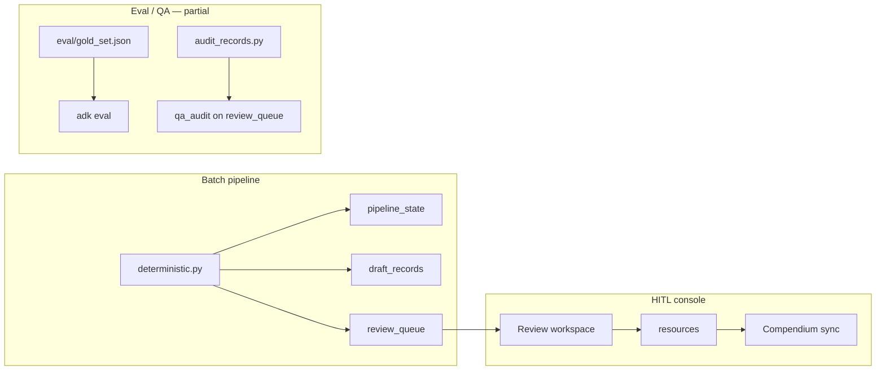

# Prompt Improvement Loop — HITL Integration Plan

## Executive summary

CoThesis already has a production **human-in-the-loop publish gate** (arbiter → Firestore `review_queue` → Next.js console → `resources` → Compendium sync) and a **20-case ADK gold eval set** with rubric criteria. What is missing is the **closed loop from reviewer corrections back into prompts**: curated gold cases, regression-gated prompt changes, and an offline "prompt lab" that proposes diffs for human merge. This document maps official ADK / Vertex evaluation and HITL patterns to the existing app, identifies gaps, and proposes a **three-phase roadmap** (quick taxonomy wins → benchmark runner → ADK prompt-lab team) that runs **beside** the deterministic batch pipeline without blocking it.

---

## Best practices (official sources)

### Human-in-the-loop in production agent systems

**When to interrupt**

| Signal | CoThesis pattern | ADK / platform pattern |
|--------|------------------|------------------------|
| Low confidence / borderline scores | Arbiter routes `review_needed` on classification_confidence, relevance, quality band, ai_confidence, panel_agreement | Route uncertain outcomes to humans; do not auto-act on sensitive paths |
| Missing required fields | `has_methodology=False` never auto-accepts | Approval gates before irreversible actions |
| Panel disagreement | `panel_agreement < 0.7` → review | Escalate when evaluators disagree |
| Parse / tool failure | Classification retry once → `review_needed` | Fail closed to human review |

**Approval gates and escalation**

- **Deterministic gate before model judgment:** CoThesis arbiter routing is pure Python (`agents/arbiter/tools.py`), not an LLM call — this matches ADK guidance to keep routing logic predictable and testable.
- **Publish is always human-ratified:** Even `auto_accept` items are written to `review_queue` with an "AUTO-ACCEPT (sampling audit)" reason; the console writes `editorial_reviewed_by` / `editorial_reviewed_at` before Compendium sync.
- **ADK-native HITL (for future in-session workflows):** ADK 2.x supports workflow interrupts via `RequestInput`, resumable `App` + `ResumabilityConfig(is_resumable=True)`, and `LongRunningFunctionTool` / `ToolConfirmation` for tool-level approval. Use unique `interrupt_id` per loop iteration to avoid restart loops.

**Sources**

- [ADK — Why Evaluate Agents](https://google.github.io/adk-docs/evaluate/) — trajectory + final response evaluation
- [ADK — Multi-agent workflows](https://google.github.io/adk-docs/agents/multi-agents/) — graph-based, collaborative patterns for specialist teams
- [ADK HITL reference (adk-python)](https://github.com/google/adk-python/blob/v2.0.0a2/.agents/skills/adk-workflow/references/human-in-the-loop.md) — `RequestInput`, resumability, `interrupt_id` in loops
- [Google Developers Blog — ADK HITL / ToolConfirmation](https://developers.googleblog.com/announcing-adk-for-java-100-building-the-future-of-ai-agents-in-java/) — pause → human approval → resume
- [Vertex Agent Platform — continuous quality improvement](https://cloud.google.com/vertex-ai/generative-ai/docs/agent-engine/overview) — Example Store + Evaluation Service as a data flywheel (test → monitor → refine)

### Prompt improvement / eval loops

**Gold sets**

- Hand-curate **20–40** representative cases spanning resource types and MVP methodologies; store as ADK `.test.json` / evalset with `session_input`, `user_content`, `intermediate_data.tool_uses`, and `final_response` or rubrics.
- Treat gold cases as **answer keys**, not training data for unsupervised self-modification.
- Extend gold set from **human corrections**: when a reviewer fixes taxonomy or rejects for a systematic error, export a minimal eval case capturing input + expected classification/editorial output.

**Regression gates**

- ADK recommends **fast, deterministic criteria for CI/CD**: `tool_trajectory_avg_score`, `response_match_score` ([ADK evaluate — recommendations on criteria](https://google.github.io/adk-docs/evaluate/)).
- Use **LLM-judge criteria** (`final_response_match_v2`, `rubric_based_final_response_quality_v1`, `hallucinations_v1`) for deeper checks; run less frequently (nightly / pre-release).
- **Never weaken thresholds to pass** — adjust prompts or gold references instead ([ADK Eval Codelab](https://codelabs.developers.google.com/adk-eval/instructions): "If the meaning is correct, do not change the prompt").
- Run `pytest -q` first (schema, routing, code mapping), then `adk eval` (see `.claude/skills/run-evals/SKILL.md`).

**Human-in-the-loop prompt merges**

1. Offline agent or script **proposes** a prompt diff with rationale tied to failing eval cases.
2. Human reviewer **approves or edits** the diff in console or PR.
3. Bump `assessment_prompt_version` (and per-agent prompt file version comment) in `agents/prompts/*.md`.
4. Re-run full eval suite; deploy only if thresholds pass.
5. **No** auto-deploy of prompt changes from production traffic or reviewer edits alone.

### Multi-agent "prompt lab" on Vertex AI / ADK 2.x

Recommended specialist roles (offline service, not in batch hot path):

| Agent | Role | Tools / inputs |
|-------|------|----------------|
| **Failure analyst** | Cluster eval failures + review_queue reject reasons by agent/stage | Read `eval/` results, Firestore export of `qa_audit`, routing reasons |
| **Prompt editor** | Draft minimal diffs to `agents/prompts/{classification,editorial,appraisal}.md` | Diff-only output; cite failing case IDs |
| **Eval arbiter** | Run `adk eval` subset; compare scores to baseline | Shell/tool wrapper; read `eval_config.json` thresholds |
| **Human merge gate** | Approve/reject proposed diffs | Console page or GitHub PR — **mandatory** |

Orchestration: ADK **SequentialAgent** or Workflow graph; isolate `VertexAiSearchTool` in its own sub-agent per project rules. Deploy prompt lab as a **separate Cloud Run Job** or local `adk web` session — not inside `deterministic.py`.

### Taxonomy classification QA

**Four taxonomy dimensions (classifier + console)**

| Dimension | Field | Source | Console |
|-----------|-------|--------|---------|
| Type + subtype | `resource_type_code`, `resource_subtype_code` | `live_subtypes.json` | TaxonomyEditor subtype select |
| Methodology | `methodology_codes` | `live_methodologies.json` | TaxonomyEditor multi-select |
| Foundation skills | `skill_codes` | `live_skills.json` (FS-01..FS-16) | TaxonomyEditor multi-select |
| Specialty | `discipline_codes` | `live_specialties.json` | TaxonomyEditor multi-select |

Classifier prompt injection mirrors methodology/subtype: `build_skill_guide()` in `agents/taxonomy.py`; Pydantic validates against `live_skills.json`. Assign skills only when the resource *teaches* the competency (not when it merely uses it). Phase 1 audit should stratify empty vs populated `skill_codes` by resource type (courses, web guides, and methodology guides are high-signal).

**Type-aware optional labels**

- Methodology codes should be **optional by resource type**: e.g. `software`, `community`, `funding` may legitimately have `methodology_codes: []`; `reporting_guideline` may map to SYN/OBS/EVAL; `article` usually should not be empty unless genuinely cross-cutting.
- Arbiter already enforces: empty methodology → `review_needed`, never silent auto-accept (`has_methodology=False`).
- Gold-set rubric `type_methodology_correct` in `eval/eval_config.json` explicitly allows empty list when none applies — align classifier prompt + audit script with per-type rules.

**Benchmark design**

- Stratify cases: `{resource_type} × {methodology presence} × {MVP vs non-MVP methodology}`.
- Include **negative cases**: force-fit methodology, legacy RS/OD codes, wrong subtype parent.
- Track per-rubric pass rates, not just aggregate score (STATE.md notes rubric judge may score all-pass — read as "no violations").

### Cost and safety guardrails for continuous improvement loops

| Guardrail | Implementation |
|-----------|----------------|
| **Budget cap** | Prompt lab Job: max N eval cases per run; use Flash-Lite for classification replays; Pro only for editorial rubric judge |
| **Rate limits** | Separate scheduler from daily batch (`Cloud Scheduler` already runs batch at 20:00 UTC); prompt lab weekly or on-demand |
| **No production prompt writes** | Prompt lab outputs PR branch or Firestore `prompt_proposals` collection — human merges to `agents/prompts/` |
| **Regression required** | Block merge if `pytest` or `adk eval` below `eval/eval_config.json` thresholds |
| **Audit trail** | `assessment_prompt_version`, `pipeline_run_id`, `model_version` on every AIAssessment (docs/AGENTS_SPEC.md) |
| **Safety** | Keep `safety_v1` + `hallucinations_v1` on editorial/appraisal paths; never auto-publish from eval pass alone |

---

## Current CoThesis HITL architecture (what exists)

### Data flow

### Firestore collections

| Collection | Purpose |
|------------|---------|
| `review_queue` | Pending human review: `draft_record`, `panel_result`, `routing`, `reason`, `status`, optional `qa_audit` |
| `pipeline_state` | Per-stage timeline for Pipeline page + Provenance tab |
| `resources` | Curator-approved published records (`editorial_reviewed_by`, `editorial_status`) |
| `draft_records` | Assembled draft before/after review |

### Console (`console/`)

| Surface | HITL capability |
|---------|-----------------|
| **Review queue** (`/review`) | Filters, bulk approve/reject, triage presets, keyboard shortcuts |
| **Review detail** (`/review/[id]`) | 3-pane workspace: description slots, **Pipeline Inspector** (Quality, Panel, Classification, Enrichment, Provenance), **TaxonomyEditor**, approve/reject/requeue |
| **QA layer** | `scripts/audit_records.py` → `/tmp/cothesis_audit.json`; `write_qa_audit.py` merges into `review_queue.qa_audit`; `QaQuickActions` + `qa-recommendations.ts` derive one-click fix/reject/requeue |
| **Pipeline** (`/pipeline`) | All processed resources; catalog editor for any record |
| **Dashboard** | Queue depth, session stats, eval summary band (`data/eval-summary.json`) |

**Completed HITL phases (STATE.md):** A (navigation, taxonomy inline, provenance), B (bulk, triage, send-back), C (undo approve, reopen, session stats).

### Pipeline and routing

- **`agents/pipeline/deterministic.py`:** Code-sequenced stages; LLM only for judgments; writes `pipeline_state` each stage; arbiter is Python gate.
- **`agents/arbiter/tools.py`:** `compute_routing_decision()` — thresholds on relevance, classification_confidence, quality_score, ai_confidence, panel_agreement; `has_methodology=False` → review.
- **`agents/shared/hitl.py`:** `write_review_queue_item()`, `get_review_status()`.
- **QC panel:** Deterministic checks (ai_pattern_scanner, voice_reviewer, plain_jargon, badges) + dimension evaluators; feeds arbiter.

### Eval assets

- **`eval/gold_set.json`:** 20 cases (4 methodologies × 5 types), ADK EvalSet schema.
- **`eval/eval_config.json`:** `rubric_based_final_response_quality_v1` (threshold 0.6) with five rubrics including `type_methodology_correct`, `routing_justified`.
- **`docs/EVAL.md`:** pytest first; ADK primitives (`tool_trajectory_avg_score`, `final_response_match_v2`, `hallucinations_v1`, rubric criteria).
- **Run convention:** `.claude/skills/run-evals/SKILL.md` — `pytest -q` then `adk eval`; paste raw scores; do not alter tests to pass.

### Audit scripts

- **`scripts/audit_records.py`:** Read-only DQ + URL liveness over `review_queue` drafts; warns on empty `methodology_codes`.
- **`scripts/write_qa_audit.py`:** Merges audit + optional source-accuracy layer into `review_queue.qa_audit` (source-accuracy layer not yet run in latest ops — see STATE.md).

---

## Gap analysis: establishing the HITL → prompt refinement loop

### Already HITL

| Capability | Status |
|------------|--------|
| Uncertain drafts surfaced to humans | ✅ Arbiter → `review_queue` |
| Human ratification before publish | ✅ Console approve → `resources` + Compendium sync |
| Inline taxonomy correction | ✅ TaxonomyEditor on review detail |
| Requeue to pipeline stage | ✅ classification / enrichment / editorial |
| QA shortcuts from audit | ✅ QaQuickActions (type, URL, reject presets) |
| Provenance / prompt version fields | ✅ Schema supports `assessment_prompt_version` |
| Gold eval set + rubrics | ✅ 20 cases + eval_config |
| Deterministic routing tests | ✅ `tests/test_arbiter_routing.py` |

### Missing for prompt refinement loop

| Gap | Impact |
|-----|--------|
| **No "flag as gold case" from review UI** | Reviewer corrections stay in Firestore; not captured as regression tests |
| **No eval failure → prompt proposal queue** | Failures require manual triage |
| **Gold set not stratified by reviewer-found errors** | Benchmark drift vs production mistakes |
| **Type-aware methodology optional rules not fully encoded** | Audit warns on all empty methodology; classifier treats all types alike |
| **No automated benchmark runner in CI / Scheduler** | Eval is manual (`/run-evals` skill) |
| **No prompt lab service** | No analyst/editor/arbiter team for offline diffs |
| **No human merge gate for prompts** | Risk of ad-hoc prompt edits without regression |
| **Source-accuracy audit layer optional / not run** | `write_qa_audit` half-populated |

### Recommended integration points

1. **Review detail → "Add to gold set"** — On approve after taxonomy edit, or on reject with reason code: export ADK eval case JSON to `eval/cases/{resource_code}.json` (pending human PR merge).
2. **Review detail → "Flag taxonomy error"** — Writes to `eval_failure_bucket`: `{resource_code, agent, field, human_label, prompt_version}` for prompt lab analyst.
3. **QA requeue → failure bucket** — When reviewer uses "Re-send for classification" from QaQuickActions, append structured failure record linked to `pipeline_run_id`.
4. **Prompt lab queue (Phase 3)** — Cloud Run Job reads failure bucket + eval report; outputs proposed diff to `prompt_proposals/{id}`; console page shows diff + eval delta.
5. **Scheduler separation** — Daily batch unchanged; weekly `adk eval` Job + optional prompt lab Job never blocks batch.

---

## Proposed 3-phase roadmap

Aligns with the approved plan in [prompt refinement discussion](caabfc48-a724-4713-9f8f-9a50c413d82c).

### Phase 1 — Quick wins (taxonomy + audit)

**Goal:** Reduce false `review_needed` and false methodology warnings; make audit type-aware.

**Concrete next steps**

1. **Method-tag optional by type** — Extend `agents/prompts/classification.md` with per-type rules; update `scripts/audit_records.py` to warn on empty methodology only for types that require tags; add pytest cases; keep arbiter `has_methodology=False` → review for required types only.
2. **Taxonomy audit script enhancements** — Subtype parent-type validation against `live_subtypes.json`; aggregate report by type.
3. **Wire source-accuracy layer** — Produce `/tmp/cothesis_source_accuracy.json`; run `write_qa_audit`.
4. **Console stub** — "Copy eval case" server action for manual gold-set PRs.

**Exit criteria:** Type-stratified audit summary; classifier documents optional-by-type rules; pytest green.

### Phase 2 — Eval gold set schema + benchmark runner

**Goal:** Regression-gated prompt changes with human-curated gold cases from production.

**Gold case schema** — Extend ADK EvalCase with `source` metadata (`resource_code`, `origin`, `prompt_versions`, `failure_mode`) and optional `expected_classification` block. Store under `eval/cases/`; aggregate into `eval/gold_set.json`.

**Benchmark runner** — `scripts/run_benchmark.py`: `pytest -q` → `adk eval` → `data/eval-summary.json`; CI on prompt/eval changes; weekly Cloud Scheduler Job; regression gate vs `eval/baseline.json`.

**Human merge workflow** — Gold cases and prompt changes via PR only; bump `assessment_prompt_version` on deploy.

**Exit criteria:** 30+ gold cases (≥5 from human corrections); automated benchmark documented in OPERATIONS.md.

### Phase 3 — ADK prompt-lab agent team

**Goal:** Offline multi-agent team proposes prompt improvements; humans merge.

| Agent | Responsibility |
|-------|----------------|
| `prompt_analyst` | Summarize failure bucket + eval regressions |
| `prompt_editor` | Unified diff for target prompt file only |
| `eval_arbiter` | Run benchmark subset; report vs baseline |
| **Human** | Approve/reject/edit before merge |

Deploy as separate ADK app + Cloud Run Job `prompt-lab-run`. Console: **"Send to prompt lab"** on review detail; `/prompt-lab` page for diff review.

**Exit criteria:** One full cycle: reviewer flag → diff → eval pass → human merge → green benchmark.

---

## What NOT to do

| Anti-pattern | Why |
|--------------|-----|
| **Unsupervised prompt auto-deploy** | No regression guarantee; drift risk |
| **Eval without regression baseline** | Hides quality drops |
| **Weakening pytest or eval tests to pass** | Violates docs/EVAL.md |
| **Prompt lab inside batch pipeline** | Blocks production curation |
| **Single global methodology requirement** | False tags on software/community resources |
| **Trusting rubric all-pass as "perfect"** | Still need human gold cases for edge cases |
| **Skipping human merge for "small" edits** | Every change needs benchmark + version bump |
| **ADK RequestInput for batch queue** | Firestore + console is correct for 298-item queue |

---

## References (project)

| Doc / path | Relevance |
|------------|-----------|
| `docs/OPERATIONS.md` | Deploy sequence, benchmark runner, human merge workflow, cost guards |
| `docs/AGENTS_SPEC.md` | Per-agent behaviour, provenance |
| `docs/EVAL.md` | Testing + observability |
| `docs/JUDGE_GUIDE.md` | Console HITL demo path |
| `agents/pipeline/deterministic.py` | Batch orchestrator |
| `agents/arbiter/tools.py` | Routing thresholds |
| `eval/gold_set.json`, `eval/eval_config.json` | Current benchmark |
| `scripts/audit_records.py`, `scripts/write_qa_audit.py` | QA audit |
| `.claude/skills/run-evals/SKILL.md` | Eval convention |

---

## Appendix: ADK eval criteria quick reference

From [ADK Evaluate](https://google.github.io/adk-docs/evaluate/):

- **CI / regression:** `tool_trajectory_avg_score`, `response_match_score`
- **Semantic match:** `final_response_match_v2`
- **No reference:** `rubric_based_final_response_quality_v1`
- **Grounding:** `hallucinations_v1`
- **Safety:** `safety_v1`

CoThesis should add classification-field assertions and trajectory checks in Phase 2.
